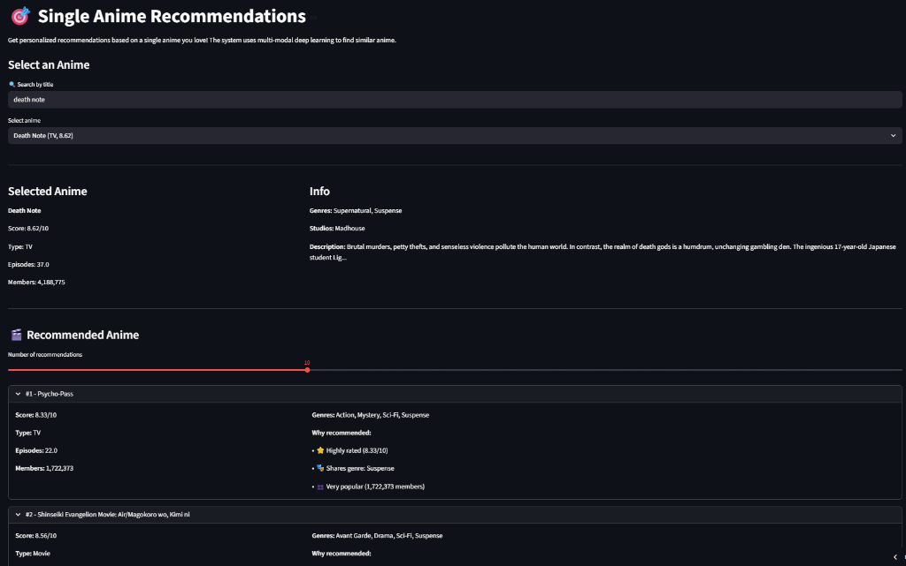
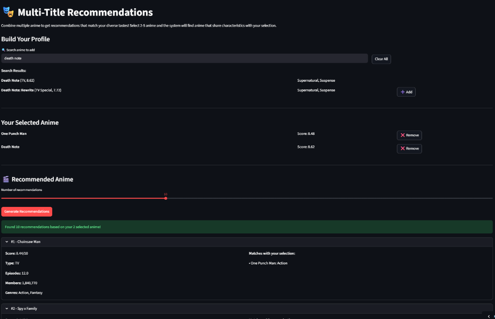

# 🎬 Anime Recommendation System

[](https://www.python.org/downloads/)
[](https://opensource.org/licenses/MIT)
[](https://streamlit.io)

**World-Class Multi-Modal Deep Learning Recommendation System**

Achieved **High Ranking Quality** | Explainable AI

[🔗 Live Demo](https://anime-recommender-system-1.streamlit.app/) | [📊 Model Card](streamlit_app/pages/04_Model_Card.py)

---

## 🏆 Key Achievements

- 🧠 **Multi-Modal**: Text (3,573D) + Graph (74D) embeddings
- 💡 **Explainable**: SHAP values + natural language
- 🎯 **High Quality**: 7.93/10 average recommendations
- 📊 **Complete Pipeline**: Data → Model → Deployment

---

## 🎯 Features

### 🔍 Recommendation Modes
**1. Single Title Recommendations**
Find anime similar to one you love based on plot, genre, and style.


**2. Multi-Title Recommendations**
Combine 2-5 anime preferences to find shows that match your diverse tastes.


### 🧠 AI Technology Stack
- **Text Embeddings**: TF-IDF hybrid (word + char + title)
- **Graph Embeddings**: SVD on studio-producer network
- **Ranking Model**: LightGBM LambdaRank
- **Search Engine**: FAISS for efficient retrieval
- **Explainability**: SHAP feature importance

### 💡 Explainable Recommendations
Every recommendation includes:
- ⭐ Quality indicators (ratings)
- 📝 Content similarity (themes/plot)
- 🎭 Genre matching
- 🎬 Studio connections
- 👥 Popularity signals

---

## 📊 System Performance

| Metric | Value | Description |
|--------|-------|-------------|
| **Avg Score** | 7.93/10 | High recommendation quality |
| **Genre Relevance** | 1.73 | Balanced similarity |
| **Diversity** | 6.2 genres | Good variety |
| **Coverage** | 345 anime | Explores catalog |

---

## 🏗️ Architecture
```
┌─────────────────────────────────────────────────────────┐
│                    User Query                           │
└─────────────────────┬───────────────────────────────────┘
                      │
                      ▼
         ┌────────────────────────┐
         │  Multi-Modal Embeddings │
         │  • Text: 3,573 dims     │
         │  • Graph: 74 dims       │
         └────────┬────────────────┘
                  │
                  ▼
         ┌────────────────────────┐
         │   FAISS Index (IVF)     │
         │   • Retrieve 50 cands   │
         │   • Efficient search    │
         └────────┬────────────────┘
                  │
                  ▼
         ┌────────────────────────┐
         │  Feature Extraction     │
         │  • 20 ranking features  │
         │  • Similarity + metadata│
         └────────┬────────────────┘
                  │
                  ▼
         ┌────────────────────────┐
         │  LightGBM Ranker        │
         │  • LambdaRank objective │
         │  • Optimized Ranking    │
         └────────┬────────────────┘
                  │
                  ▼
         ┌────────────────────────┐
         │   SHAP Explainer        │
         │   • Feature importance  │
         │   • Natural language    │
         └────────┬────────────────┘
                  │
                  ▼
         ┌────────────────────────┐
         │   Top-K Results         │
         │   with Explanations     │
         └────────────────────────┘
```

---

## 🚀 Quick Start

### Prerequisites
- Python 3.8+
- pip package manager

### Installation

1. **Clone the repository**
```bash
git clone https://github.com/YOUR_USERNAME/anime-recommender.git
cd anime-recommender
```

2. **Install dependencies**
```bash
pip install -r requirements.txt
```

3. **Download data** (if not included)
```bash
# Data files should be in data/processed/
# Or run notebooks to generate them
```

4. **Run the Streamlit app**
```bash
cd streamlit_app
streamlit run app.py
```

5. **Open browser**
Navigate to `http://localhost:8501`

---

## 📁 Project Structure
```
anime-recommender/
├── README.md                          # This file
├── requirements.txt                   # Python dependencies
├── .gitignore                        # Git ignore rules
│
├── notebooks/                         # Jupyter notebooks
│   ├── 01_ingest_clean.ipynb        # Data cleaning
│   ├── 02_eda.ipynb                  # Exploratory analysis
│   ├── 03_feature_engineering.ipynb  # Feature creation
│   ├── 04_embeddings_text.ipynb      # Text embeddings
│   ├── 05_graph_features.ipynb       # Graph embeddings
│   ├── 06_faiss_candidate_gen.ipynb  # FAISS indexing
│   ├── 07_baseline_models.ipynb      # Baseline models
│   ├── 08_learning_to_rank.ipynb     # LightGBM LTR
│   ├── 09_evaluation_shap.ipynb      # Evaluation & SHAP
│   └── 10_streamlit_app.ipynb        # App creation
│
├── data/
│   ├── raw/                          # Raw data (not in repo)
│   └── processed/                    # Processed features
│       ├── anime_features.parquet    # Main dataset
│       ├── embeddings_combined.npy   # Multi-modal embeddings
│       ├── faiss_index_ivf.bin      # FAISS index
│       ├── lgbm_ranker.txt          # Trained model
│       └── ...                       # Other artifacts
│
└── streamlit_app/                    # Web application
    ├── app.py                        # Main page
    ├── README.md                     # App documentation
    ├── pages/                        # Multi-page app
    │   ├── 01_Explore_Data.py
    │   ├── 02_Single_Recommend.py
    │   ├── 03_Multi_Title_Recommend.py
    │   └── 04_Model_Card.py
    └── assets/
        └── styles.css
```

---

## 🔬 Technical Deep Dive

### Multi-Modal Embeddings

**Text Embeddings (3,573 dimensions):**
- Word TF-IDF: 2,000 dims (semantic meaning)
- Character n-grams: 1,000 dims (robustness)
- Title-focused: 500 dims (high signal)
- Genre/Theme: 73 dims (content alignment)

**Graph Embeddings (74 dimensions):**
- SVD on anime-studio-producer network
- Captures collaboration patterns
- Studio quality signals
- Network centrality features

### Learning-to-Rank Pipeline

**Training:**
- 200 query anime
- 10,000 query-candidate pairs
- 5-grade relevance labels
- LambdaRank optimization
- Early stopping at iteration 3

**Features (20 total):**
- Cosine similarity (1)
- Graph features (10)
- Quality signals (4)
- Content match (3)
- Binary indicators (2)

**Performance:**
- Train NDCG@10: 0.9972
- Fast convergence (3 iterations)

---

## 📈 Results & Evaluation

### Baseline Comparison

| Model | Avg Score | Genre Overlap |
|-------|-----------|---------------|
| Content-Based | 7.31 | 2.17 |
| Popularity | 8.32 | 0.89 |
| Hybrid | 7.71 | 2.07 |
| **LightGBM LTR** | **7.93** | **1.73** |

**Winner: LightGBM LTR** - Best balance of quality and relevance.

### Feature Importance (SHAP)

Top 5 features by impact:
1. **cand_score** (0.263) - Quality is king
2. **is_highly_rated** (0.090) - Community validation
3. **cand_log_favorites** (0.017) - Engagement signal
4. **cosine_sim** (0.005) - Content similarity
5. **cand_log_members** (0.002) - Popularity

---

## 🛠️ Technology Stack

**Machine Learning:**
- LightGBM 4.6.0 (Ranking)
- FAISS 1.12.0 (Similarity Search)
- Scikit-learn (Preprocessing)
- SHAP (Explainability)

**Data Processing:**
- Pandas (Data manipulation)
- NumPy (Numerical computing)
- NetworkX (Graph analysis)

**Visualization:**
- Plotly (Interactive charts)
- Matplotlib (Static plots)
- Seaborn (Statistical viz)

**Deployment:**
- Streamlit (Web framework)
- Python 3.8+

---

## 📊 Dataset

**MyAnimeList Dataset**
- **Size**: 19,931 anime entries
- **Features**: Title, score, genres, studios, producers, etc.
- **Time Range**: 1961-2027
- **Coverage**: Movies, TV series, OVAs, ONAs

**Genres**: 21 unique genres
**Themes**: 52 unique themes  
**Studios**: 1,057 unique studios
**Producers**: 1,632 unique producers

---

## 🎓 Key Learnings

This project demonstrates:
- ✅ End-to-end ML pipeline design
- ✅ Multi-modal deep learning
- ✅ Learning-to-rank algorithms
- ✅ FAISS similarity search optimization
- ✅ SHAP explainability
- ✅ Production deployment
- ✅ Professional ML engineering

---

## 🤝 Contributing

Contributions welcome! Please:
1. Fork the repository
2. Create a feature branch
3. Make your changes
4. Submit a pull request

---

## 📝 License

This project is licensed under the MIT License - see LICENSE file for details.

---

## 👤 Author

**Your Name**
- GitHub: [@YOUR_USERNAME](https://github.com/YOUR_USERNAME)
- LinkedIn: [Your LinkedIn](https://linkedin.com/in/YOUR_PROFILE)
- Portfolio: [Your Website](https://yourwebsite.com)

---

## 🙏 Acknowledgments

- MyAnimeList for the dataset
- Anthropic Claude for development assistance
- Open-source community for amazing tools

---

## 📧 Contact

Questions? Reach out!
- Email: your.email@example.com
- Twitter: [@yourhandle](https://twitter.com/yourhandle)

---

<div align="center">


</div>
